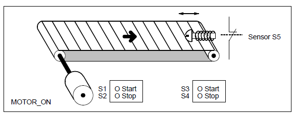
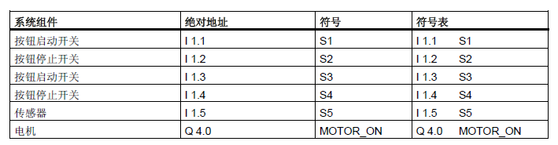
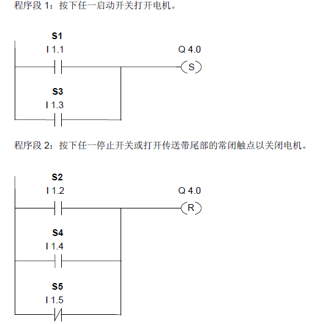

# LAB 2  控制传送带

## 实验要求
下图显示可用电动方式激活的传送带。在传送带的开始位置有两个按钮开关：用于启动的S1 和用于停止的S2。在传送带末端也有两个按钮开关：用于启动的S3 和用于停止的S4。可从任何一端启动或停止传送带。此外，当传送带上的部件到达终点时，传感器S5 将停止传送带。

<!--sec data-title="符号表" data-id="symbol" data-show=true ces-->


<button class="section" target="ans" show="显示参考梯形图" hide="隐藏参考梯形图"></button>
<!--endsec-->

<!--sec data-title="参考梯形图" data-id="ans" data-show=false ces-->

<!--endsec-->
