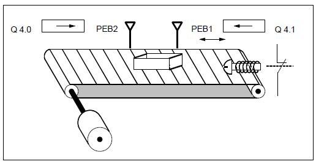
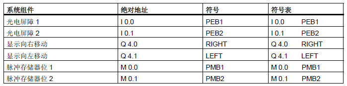
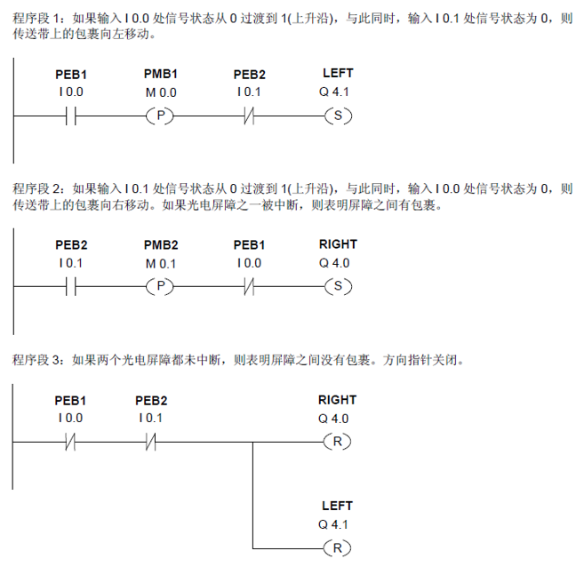

# LAB 3  检测传送带方向

## 实验要求
下图显示配备两个光电屏障(PEB1 和PEB2)的传送带，这两个光电屏障专用于检测包裹在传送带上移动的方向。每个光电屏障的功能类似常开触点。

<!--sec data-title="符号表" data-id="symbol" data-show=true ces-->


<button class="section" target="ans" show="显示参考梯形图" hide="隐藏参考梯形图"></button>
<!--endsec-->

<!--sec data-title="参考梯形图" data-id="ans" data-show=false ces-->

<!--endsec-->
