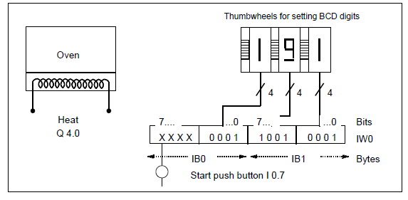
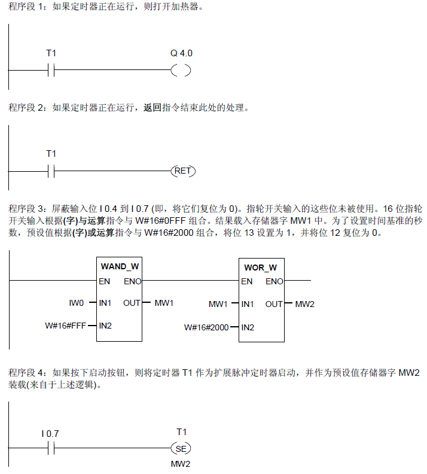

# LAB 4  加热烘炉

## 实验要求
烘炉操作员通过按启动按钮来启动烘炉加热。操作员可用图中所示的码盘开关来设置加热的时间。操作员设置的值以二进制编码的十进制(BCD)格式显示，单位为秒。

<!--sec data-title="符号表" data-id="symbol" data-show=true ces-->


<button class="section" target="ans" show="显示参考梯形图" hide="隐藏参考梯形图"></button>
<!--endsec-->

<!--sec data-title="参考梯形图" data-id="ans" data-show=false ces-->

<!--endsec-->
