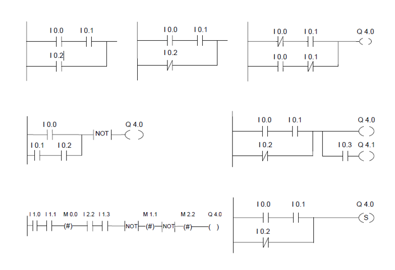
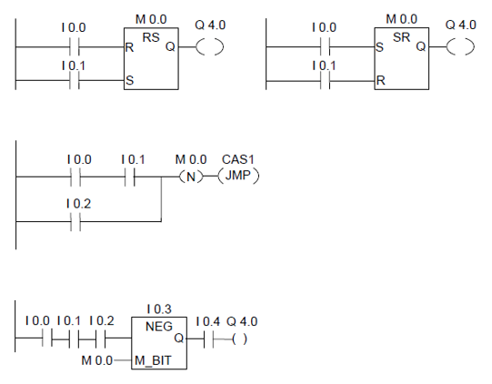

# 位逻辑指令

-   ---| |--- 常开触点(地址)
-   ---|/|--- 常闭触点(地址)
-   ---(SAVE) 将RLO 状态保存到BR
-   XOR 位异或运算
-   ---( ) 输出线圈
-   ---( # )--- 中间输出
-   ---|NOT|--- 取反使能位

-   ---( S ) 置位线圈
-   ---( R ) 复位线圈
-   SR 复位优先型SR 双稳态触发器
-   RS 置位优先型RS 双稳态触发器

-   ---(N)--- RLO 负跳沿检测
-   ---(P)--- RLO 正跳沿检测
-   NEG 地址下降沿检测
-   POS 地址上升沿检测

