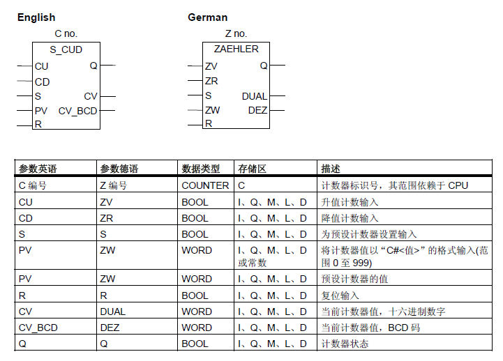
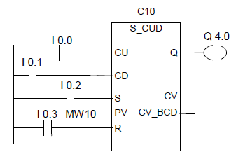

# 计数器指令
- S_CUD 双向计数器
- S_CD 降值计数器
- S_CU 升值计数器
- ---( SC ) 设置计数器线圈
- ---( CU ) 升值计数器线圈
- ---( CD ) 降值计数器线圈

- 如果输入S 有上升沿，S_CUD(双向计数器)预置为输入PV 的值。如果输入R 为1，则计数器复位，并将计数值设置为零。如果输入CU 的信号状态从“0”切换为“1”，并且计数器的值小于“999”，则计数器的值增1。如果输入CD 有上升沿，并且计数器的值大于“0”，则计数器的值减1。

- 如果两个计数输入都有上升沿，则执行两个指令，并且计数值保持不变。

- 如果已设置计数器并且输入CU/CD为RLO = 1，则即使没有从上升沿到下降沿或下降沿到上升沿的变化，计数器也会在下一个扫描周期进行相应的计数。

- 如果计数值大于等于零(“0”)，则输出Q 的信号状态为“1”。

