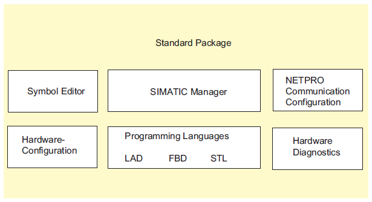

# STEP 7概述

## 什么是STEP 7？
STEP 7是一种用于对SIMATIC可编程逻辑控制器进行组态和编程的标准软件包。

它是SIMATIC工业软件的一部分。
- 可作为SIMATIC工业软件的软件产品中的一个扩展选项包(参见STEP 7标准软件包的扩展使用)
- 为功能模块和通讯处理器分配参数的时机
- 强制模式与多值计算模式
- 全局数据通讯
- 使用通讯功能块进行的事件驱动数据传送
- 组态连接

## STEP 7中的应用程序
