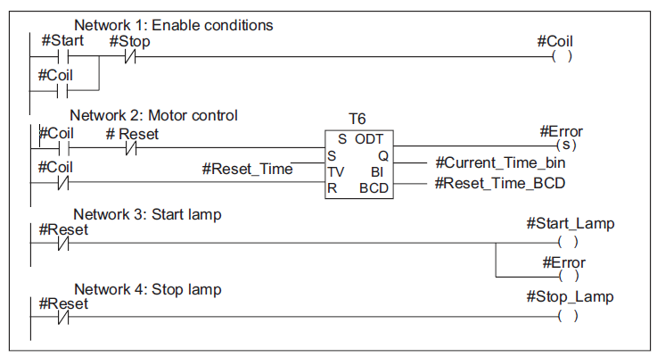
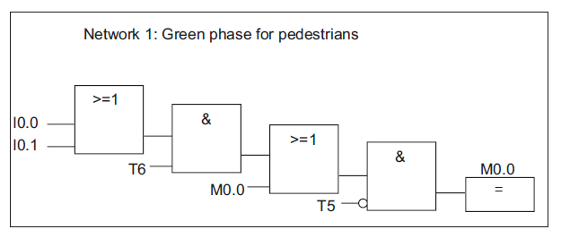
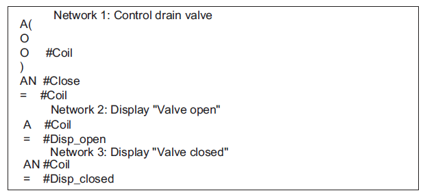

# 编程语言
S7-300和S7-400的编程语言梯形图、语句表和功能块图是标准软件包的一个重要
组成部分。
- **梯形图(或LAD)**是STEP 7编程语言的图形表示。其指令语法与传递梯形图相
似：梯形图允许在能流过各种触点、复杂元件和输出线圈时，跟踪母线之间的电
量流。
- 语句表(或STL)是STEP 7编程语言的文本表示，与机器代码相似。如果用语句
表书写程序，则每条指令都与CPU执行程序的步骤相对应。为便于编程，语句
表已经扩展包括一些高级语言结构(如结构化数据访问和块参数)。
- 功能块图(FBD)是STEP 7编程语言的图形表示，使用布尔代数惯用的逻辑框表
示逻辑功能。复杂功能(如算术功能)可直接结合逻辑框表示。

**本章所述内容对于这些编程语言都适用，根据课程要求下一章中重点讲解梯形图**

## 梯形图(LAD)
图形编程语言“梯形图(LAD)”以电路图表示为基础。电路图的元件，例如常开触点和常闭触点，相互组合，从而构成程序段。逻辑块的代码段表示一个或多个程序段。

## 功能块图(FBD)
编程语言“功能块图 (FBD)”以布尔代数中众所周知的图形逻辑符号为基础。也可以通过逻辑框的组合直接显示诸如数学功能的复杂功能。

## 语句表(STL)
编程语言STL是一种基于文本的编程语言，它具有一种类似机器代码的结构。每个语句代表CPU的一种程序处理操作。多个语句链接在一起就构成了程序段。

