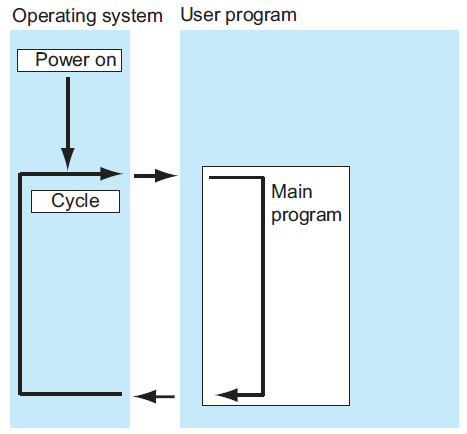
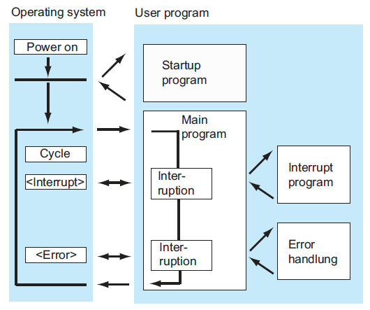
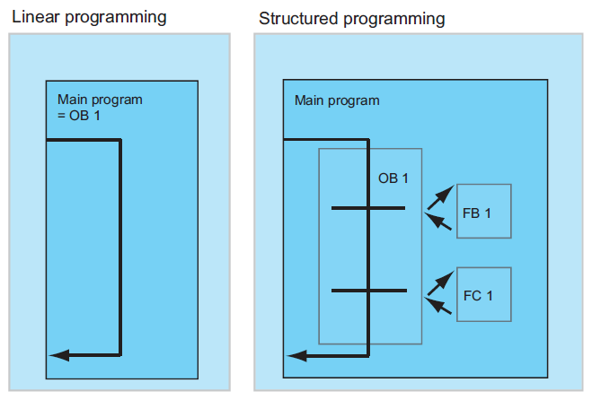
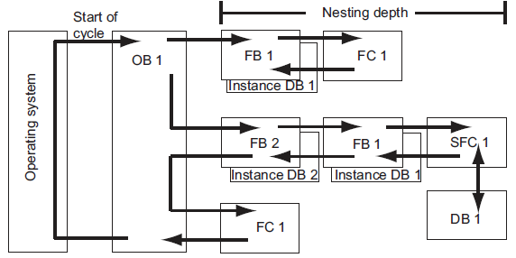

# 设计程序结构的基本原理
## CPU中的程序
CPU 原则上运行两个不同的程序：
- 操作系统
- 用户程序

### 操作系统
每个CPU都带有集成的操作系统，组织与特定控制任务无关的所有CPU功能和顺序。操作系统任务包括下列各项：
- 处理重启(热启动)和热重启。
- 更新输入的过程映像表，并输出输出过程映像表
- 调用用户程序
- 采集中断信息，调用中断OB。
- 识别错误并进行错误处理
- 管理内存区域
- 与编程设备和其它通讯伙伴进行通讯

通过修改操作系统参数(操作系统默认设置)，可以在某些区域影响CPU响应。

### 用户程序
可以创建用户程序，并将其下载到CPU中。它包含处理特定自动化任务所要求的所有功能。用户程序任务包括：
- 确定CPU的重启(热启动)和热重启条件(例如，用特定值初始化信号)
- 处理过程数据(例如，产生二进制信号的逻辑链接，获取并评估模拟量信号，指定用于输出的二进制信号，输出模拟值)
- 响应中断
- 处理正常程序周期中的干扰。

## 用户程序中的块
### 块的类型

|块								| 功能简介												|
|-------------------------------|-------------------------------------------------------|
|组织块(OB)						|OB确定用户程序的结构									|
|系统功能块(SFB)和系统功能(SFC)	|SFB和SFC集成在S7 CPU中，可以用来访问一些重要的系统功能	|
|功能块(FB)						|FB是带有用户可自行编程的“存储器”的块					|
|功能(FC)						|FC包含频繁使用功能的例行程序							|
|实例数据块(实例DB)				|调用FB/SFB时，实例DB与块关联。它们在编译期间自动创建	|
|数据块 (DB)					|DB是用于存储用户数据的数据区。							|

### 组织块的类型
|类型 							|组织块 		|
|-------------------------------|---------------|
|主程序扫描						|OB1			|
|时间中断						|OB10-OB17		|
|延时中断						|OB20-OB23		|
|循环中断						|OB30-OB38		|						

## 程序的结构
### 循环程序处理

### 事件驱动的程序处理

### 线性编程与结构化编程

### 用户程序中的调用体系
